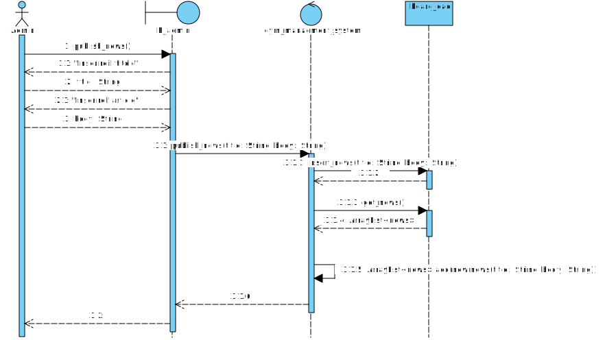
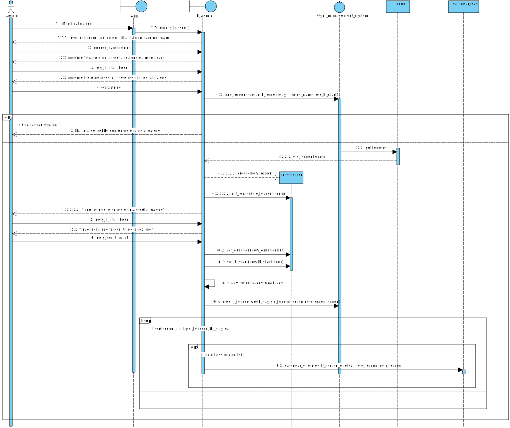

# Not Avaible
 The H2 Database is not avaible anymore therefore the code doesn't build successfully
 
 # Applicazione web gestione centro sportivo

**Compilazione:** Usare il comando `mvn assembly:assembly -DdescriptorId=jar-with-dependencies` all'interno di gym_manager per compilare con Maven il programma

## Traccia

Si vuole realizzare una applicazione web per la gestione di un centro sportivo.
L’accesso al centro sportivo è regolato da un calendario gestito dall’amministrazione che ne stabilisce i giorni e gli orari di apertura e chiusura. Inoltre l’amministrazione ha il compito di pubblicare le news (es. chiusure straordinarie, eventi, etc.). [Titolo e corpo]  
Gli abbonati possono utilizzare l’applicazione per richiedere informazioni all’amministrazione, consultare il calendario dei corsi e le news del centro sportivo. Inoltre gli abbonati possono ricercare i corsi in base al nome e in base all’orario.  
Al momento dell’iscrizione, per ciascun cliente viene memorizzato il nome, il cognome, il codice cliente e l’email. A ciascun cliente viene poi associato un abbonamento che può essere mensile o annuale. Per ciascun abbonamento si vuole memorizzare l’identificativo, la data di sottoscrizione, la data di scadenza e il prezzo. Per gli abbonamenti annuali si vuole memorizzare anche l’eventuale data di sospensione.  
Il centro sportivo è composto da una sala pesi, sala per corsi, una piscina e un centro benessere. Ogni cliente possiede una scheda. La scheda per la sala pesi indica gli esercizi da svolgere, il numero di ripetizioni e la frequenza. Gli abbonati possono inoltre partecipare ai corsi. Tutti i corsi si svolgono nella sala per i corsi.
Le sale per corsi possiedono un numero identificativo e il numero di posti a disposizione. Per ogni corso si vuole memorizzare il codice del corso, il nome, l’istruttore, il giorno, l’ora di inizio e la durata.  
Quando un abbonato ricerca il corso in base all’ora di inizio, l’applicazione deve essere in grado di fornire tutte le informazioni relative ai corsi che cominciano all’ora indicata.

## Indice

- [Analisi dei costi](#analisi-dei-costi)

  - [Valutazione degli Unadjusted Function Point](#valutazione-degli-unadjusted-function-point)
  - [Complessità delle ILF](#complessità-delle-ilf)
  - [Complessità delle EI](#complessità-delle-ei)
  - [Complessità delle EQ](#complessità-delle-eq)
  - [Fattori Correttivi](#fattori-correttivi)
  - [Conteggio finale UFP](#conteggio-finale-ufp)

- [Specifica dei requisiti](#specifica-dei-requisiti)

  - [Diagramma dei casi d’uso](#diagramma-dei-casi-duso)
  - [Sequenza dei casi d’uso](#Sequenza-dei-casi-duso)

- [Diagramma delle classi](#diagramma-delle-classi)

- [Diagramma di sequenza dinamici](#diagramma-di-sequenza-dinamici)
  - [Diagramma inserimento lezione](#diagramma-inserimento-lezione)
  - [Diagramma modifica lezione](#diagramma-modifica-lezione)
  - [Diagramma cancellazione lezione](#diagramma-cancellazione-lezione)
  - [Diagramma ricerca lezione](#diagramma-ricerca-lezione)
  - [Diagramma aggiungi bbonato](#diagramma-aggiungi-abbonato)
  - [Diagramma cancellazione Abbonato](#diagramma-cancellazione-abbonato)
  - [Diagramma modifica Orario](#diagramma-modifica-orario)
  - [Diagramma pubblica news](#diagramma-pubblica-news)
  - [Diagramma lettura calendario](#diagramma-lettura-calendario)
  - [Diagramma contatta supporto](#diagramma-contatta-supporto)
- [Diagramma delle classi raffinato](#diagramma-delle-classi-raffinato)

- [Diagramma di sequenza raffinati](#diagramma-di-sequenza-raffinati)
  - [Diagramma inserimento lezione raffinato](#diagramma-inserimento-lezione-raffinato)
  - [Diagramma ricerca lezione raffinato](#diagramma-ricerca-lezione-raffinato)
  - [Diagramma pubblica news raffinato](#diagramma-pubblica-news-raffinato)
  - [Diagramma modifica lezione raffinato](#diagramma-modifica-lezione-raffinato)

- [Diagramma delle classi di progettazione](#diagramma-delle-classi-di-progettazione)

- [Diagramma di sequenza di progettazione](#diagramma-di-sequenza-di-progettazione)
  - [Diagramma ricerca lezione di progettazione](#diagramma-ricerca-lezione-di-progettazione)
  - [Diagramma inserimento lezione di progettazione](#diagramma-inserimento-lezione-di-progettazione)
  - [Diagramma pubblica news di progettazione](#diagramma-pubblica-news-di-progettazione)
  - [Diagramma modifica lezione di progettazione](#diagramma-modifica-lezione-di-progettazione)

## Analisi dei Costi

### Valutazione degli Unadjusted Function Point

**Internal Logical FIle:** Calendario, News, Dati*Clienti, Corsi (4)  
**External Logical FIle:** \_Nessuno*  
**External Input:** Abbonato(IMD), News(I), Calendario(M),Lezione(IMD) (8)  
**External Output:** _Nessuno_  
**External Inquiry:** Ricerca_Corsi, Stampa_News, Stampa_Calendario (3)

### Complessità delle ILF

| Nome         | DET  | RET | PESO   |
| ------------ | ---- | --- | ------ |
| Calendario   | \<20 | 1   | low(7) |
| News         | \<20 | 1   | low(7) |
| Dati Clienti | \<20 | 3   | low(7) |
| Corsi        | \<20 | 1   | low(7) |

### Complessità delle EI

| Nome       | Funzionalità | DET                  | FTR | Peso   |
| ---------- | ------------ | -------------------- | --- | ------ |
| Abbonato   | Inserimento  | 13+2 (msg+com)       | 1   | low(3) |
|            | Modifica     | 13+2 (msg+com)       | 1   | low(3) |
|            | Eliminazione | 13+2+1(msg+com+conf) | 1   | avg(4) |
| News       | Inserimento  | 2+3(news+calend)     | 2   | avg(4) |
| Calendario | Modifica     | 3+2(msg+com)         | 1   | low(3) |
| Lezione    | Inserimento  | 8+2(msg+com)         | 2   | avg(4) |
|            | Modifica     | 8+2(msg+com)         | 2   | avg(4) |
|            | Eliminazione | 8+2+1(msg+com+conf)  | 2   | avg(4) |

### Complessità delle EQ

| Nome              | DET | FTR | Peso   |
| ----------------- | --- | --- | ------ |
| Ricerca Corsi     | 5   | 1   | low(3) |
| Stampa News       | 4   | 1   | low(3) |
| Stampa Calendario | 8   | 1   | low(3) |

### Fattori Correttivi

| CARATTERISTICHE GENERALI          | VALORI | DESCRIZIONE VALORE                                                                                    |
| --------------------------------- | ------ | ----------------------------------------------------------------------------------------------------- |
| COMUNICAZIONE DATI                | 4      | L' applicazione è più di un front-end ma supporta solo un tipo di protocollo di comunicazione         |
| DISTRIBUZIONE ELABORAZIONE        | 0      | L’applicazione non supporta il trasferimento dati o funzioni di processo tra I componenti del sistema |
| PRESTAZIONI                       | 1      | I requisiti prestazionali espressi non comportano azioni particolari                                  |
| UTILIZZO INTENSIVO CONFIGURAZIONE | 2      | Occorre fare considerazioni su sicurezza e tempi                                                      |
| FREQUENZA DELLE TRANSAZIONI       | 1      | È previsto un periodo di picco delle transazioni                                                      |
| INSERIMENTO DATI INTERATTIVO      | 5      | Fra 30% e 100%                                                                                        |
| EFFICIENZA PER L'UTENTE FINALE    | 3      | Intensiva presenza di ausili web per l’utente                                                         |
| AGGIORNAMENTO INTERATTIVO         | 3      | È possibile aggiornare la maggior parte di ILF                                                        |
| COMPLESSITA' ELABORATIVA          | 0      | Nessuna particolare complessità                                                                       |
| RIUSABILITA'                      | 4      | L' applicazione è stata specificatamente progettata, essa è personalizzabile a livello di codice      |
| FACILITA' INSTALLAZIONE           | 0      | Non ci sono specifiche e l'installazione non richiede particolari inizializzazioni                    |
| FACILITA' GESTIONE OPERATIVA      | 2      | L'applicazione deve svolgere operazioni non presidiate                                                |
| MOLTEPLICITA' DI SITI             | 1      | Si è considerata l' installazione in più siti con hardware e software identici                        |
| FACILITA' DI MODIFICA             | 0      | Non presenta facilitazioni per la modifica della struttura logica.                                    |

### Conteggio finale UFP

| Indice | Valore | VPI |
| ------ | ------ | --- |
| NEI    | 8      | 29  |
| NEQ    | 3      | 9   |
| NILF   | 4      | 28  |

ΣFⱼ= **26**  
UFP= **66**  
AFP=(0.65+0.01xΣFⱼ)= **0,91**  
FP=AFPxUFP= **60,06 ≃ 60**

### Adozione linguaggio programmazione (LLOC)

C++ = ~3000  
Java = ~3180  
HTML= ~2040

## Specifica dei requisiti

Generalmente un requisito si presenta in una forma del tipo:  
<ID\> <SISTEMA\> <TIPO\> <PRIORITÀ\>

ove:

- <ID\> è un identificativo univoco del requisito;

- <SISTEMA\> è il sistema o sua parte a cui si attribuisce;

- <TIPO\> indica la tipologia del requisito; esempi sono:

  - FUN: indica un requisito su una funzionalità del sistema;
  - PRE: indica un requisito prestazionale;
  - PER: indica un requisito di persistenza dei dati;
  - AFF: indica un requisito di affidabilità;
  - DIS: indica un requisito di disponibilità del sistema software;
  - SIC: indica un requisito di sicurezza.

- <PRIORITÀ\> può assumere valori quali “obbligatorio”, “opzionale”, …;

Spesso si adotta il metodo MoSCoW per attribuire le priorità, che identifica quattro
categorie di priorità: Must, Must not, Should, Could, Won’t/Would.

F.1 **AW FUN** <must\>: Il sistema deve permettere all’amministratore l’inserimento, la modifica e l’eliminazione dei dati dei clienti abbonati, che includono le generalità, la scheda e l’abbonamento.  
F.2 **AW FUN** <must\>: Il sistema deve permettere all’amministratore la modifica e l’eliminazione dei dati dei clienti abbonati, tramite una ricerca dei clienti.
F.3 **AW FUN** <must\>: Ciascun abbonato deve poter consultare il calendario degli orari di apertura e chiusura, degli orari dei corsi e le news.  
F.4 **AW FUN** <must\>: Il sistema deve permettere all’amministratore l’inserimento,
la modifica e l’eliminazione dei dati dei corsi.  
F.5 **AW FUN** <must\>: Ciascun abbonato deve potersi iscrivere a qualsiasi corso.  
F.6 **AW FUN** <must\>: L’abbonato deve poter ricercare i corsi in base all’ora d’inizio e fornendo tutte le indicazioni relative ai corsi che iniziano alla stessa ora.  
F.7 **AW FUN** <must\>: L’abbonato deve poter ricercare i corsi in base al nome del corso.  
A.1 **AW AFF** <should\>: Il sistema dovrebbe consentire di comunicare la sala del corso per ogni lezione.  
A.2 **AW AFF** <must\>: Il sistema deve verificare la disponibilità delle sale per i corsi quando un abbonato vuole iscriversi.

### Diagramma dei casi d’uso

### Sequenze dei casi d’uso

#### Insert Lesson

| Campo                             | Valore                                                                                                         |
| --------------------------------- | -------------------------------------------------------------------------------------------------------------- |
| ID                                | 1                                                                                                              |
| Breve descrizione                 | L’amministratore registra una nuova lezione                                                                    |
| Attori primari                    | Amministratore                                                                                                 |
| Attori secondari                  | _Nessuno_                                                                                                      |
| Precondizioni                     | L’amministratore è stato autenticato dal sistema                                                               |
| Sequenza degli eventi principale  | 1. Il sistema verifica la non esistenza della lezione   2. L’amministratore inserisce i dati della lezione. |
| Postcondizioni                    | I dati del corso sono salvati correttamente nel sistema.                                                       |
| Sequenza degli eventi alternativa | _Nessuna_                                                                                                      |

#### Modify Lesson

| Campo                             | Valore                                                                                                                                |
| --------------------------------- | ------------------------------------------------------------------------------------------------------------------------------------- |
| ID                                | 2                                                                                                                                     |
| Breve descrizione                 | L’amministratore modifica una lezione già presente.                                                                                   |
| Attori primari                    | Amministratore                                                                                                                        |
| Attori secondari                  | _Nessuno_                                                                                                                             |
| Precondizioni                     | L’amministratore è stato autenticato dal sistema.                                                                                     |
| Sequenza degli eventi principale  | 1. Include (Search Lesson).   2. Il sistema ricerca e mostra i dati dei corsi.   3. L’amministratore modifica i dati dei corsi. |
| Postcondizioni                    | I dati della lezione sono stati modificati e salvati correttamente.                                                                   |
| Sequenza degli eventi alternativa | _Nessuna_                                                                                                                             |

#### Delete Lesson

| Campo                             | Valore                                                                                                                                   |
| --------------------------------- | ---------------------------------------------------------------------------------------------------------------------------------------- |
| ID                                | 3                                                                                                                                        |
| Breve descrizione                 | L’amministratore cancella una lezione già presente.                                                                                      |
| Attori primari                    | Amministratore                                                                                                                           |
| Attori secondari                  | _Nessuno_                                                                                                                                |
| Precondizioni                     | L’amministratore è stato autenticato dal sistema.                                                                                        |
| Sequenza degli eventi principale  | 1. Include (Search Lesson).   2. Il sistema ricerca e mostra i dati dei corsi.   3. L’amministratore elimina i dati della lezione. |
| Postcondizioni                    | I dati dell’abbonato sono stati cancellati correttamente.                                                                                |
| Sequenza degli eventi alternativa | _Nessuna_                                                                                                                                |

#### Modify Hour

| Campo                             | Valore                                                                                                                                |
| --------------------------------- | ------------------------------------------------------------------------------------------------------------------------------------- |
| ID                                | 4                                                                                                                                     |
| Breve descrizione                 | L’amministratore modifica gli orari di apertura e chiusura del centro sportivo.                                                       |
| Attori primari                    | Amministratore                                                                                                                        |
| Attori secondari                  | _Nessuno_                                                                                                                             |
| Precondizioni                     | L’amministratore è stato autenticato dal sistema.                                                                                     |
| Sequenza degli eventi principale  | 1. Il sistema mostra gli orari preesistenti (ricerca intrinseca).   2. L'amministratore modifica gli orari di apertura e chiusura. |
| Postcondizioni                    | I dati degli orari sono stati modificati e salvati correttamente.                                                                     |
| Sequenza degli eventi alternativa | _Nessuna_                                                                                                                             |

#### Add Subscriber

| Campo                             | Valore                                                                                                          |
| --------------------------------- | --------------------------------------------------------------------------------------------------------------- |
| ID                                | 5                                                                                                               |
| Breve descrizione                 | L’amministratore aggiunge un profilo.                                                                           |
| Attori primari                    | Amministratore                                                                                                  |
| Attori secondari                  | _Nessuno_                                                                                                       |
| Precondizioni                     | L’amministratore è stato autenticato dal sistema.                                                               |
| Sequenza degli eventi principale  | 1. Il sistema verifica la non esistenza dell’abbonato.   2. L’amministratore inserisce i dati dell’abbonato. |
| Postcondizioni                    | I dati dell’abbonato sono stati salvati correttamente.                                                          |
| Sequenza degli eventi alternativa | _Nessuna_                                                                                                       |

#### Search Subscriber

| Campo                             | Valore                                                                                                                                                                                                                                                                                                                                                                                                                     |
| --------------------------------- | -------------------------------------------------------------------------------------------------------------------------------------------------------------------------------------------------------------------------------------------------------------------------------------------------------------------------------------------------------------------------------------------------------------------------- |
| ID                                | 6                                                                                                                                                                                                                                                                                                                                                                                                                          |
| Breve descrizione                 | Il sistema ricerca il profilo secondo i criteri inseriti dall’amministratore                                                                                                                                                                                                                                                                                                                                               |
| Attori primari                    | Amministratore                                                                                                                                                                                                                                                                                                                                                                                                             |
| Attori secondari                  | _Nessuno_                                                                                                                                                                                                                                                                                                                                                                                                                  |
| Precondizioni                     | L’amministratore è stato autenticato dal sistema.                                                                                                                                                                                                                                                                                                                                                                          |
| Sequenza degli eventi principale  | 1. Il sistema chiede all’amministratore i criteri di ricerca.   2. L’amministratore inserisce i criteri di ricerca.   3. Il sistema ricerca in memoria l'abbonato inserito.   4. Se l'abbonato è stato trovato:   &nbsp;&nbsp;&nbsp; 4.1. II sistema restituisce i dati dell'abbonato ricercato   5. Altrimenti:   &nbsp;&nbsp;&nbsp; 5.1. Il sistema comunica che l’abbonato non è presente in memoria. |
| Postcondizioni                    | _Nessuna_                                                                                                                                                                                                                                                                                                                                                                                                                  |
| Sequenza degli eventi alternativa | _Nessuna_                                                                                                                                                                                                                                                                                                                                                                                                                  |

#### Modify Subscriber

| Campo                             | Valore                                                                                                                                            |
| --------------------------------- | ------------------------------------------------------------------------------------------------------------------------------------------------- |
| ID                                | 7                                                                                                                                                 |
| Breve descrizione                 | L’amministratore modifica il profilo di un abbonato                                                                                               |
| Attori primari                    | Amministratore                                                                                                                                    |
| Attori secondari                  | _Nessuno_                                                                                                                                         |
| Precondizioni                     | L’amministratore è stato autenticato dal sistema.                                                                                                 |
| Sequenza degli eventi principale  | 1. Include (Search Subscriber).   2. Il sistema ricerca e mostra i dati degli abbonati.   3. L'amministratore modifica i dati dell'abbonato |
| Postcondizioni                    | I dati dell’abbonato sono stati modificati e salvati correttamente.                                                                               |
| Sequenza degli eventi alternativa | _Nessuna_                                                                                                                                         |

#### Delete Subscriber

| Campo                             | Valore                                                                                                                                           |
| --------------------------------- | ------------------------------------------------------------------------------------------------------------------------------------------------ |
| ID                                | 8                                                                                                                                                |
| Breve descrizione                 | L’amministratore cancella il profilo di un abbonato                                                                                              |
| Attori primari                    | Amministratore                                                                                                                                   |
| Attori secondari                  | _Nessuno_                                                                                                                                        |
| Precondizioni                     | L’amministratore è stato autenticato dal sistema.                                                                                                |
| Sequenza degli eventi principale  | 1. Include (Search Subscriber).   2. Il sistema ricerca e mostra i dati dell'abbonato   3. L'amministratore cancella i dati dell'abbonato. |
| Postcondizioni                    | I dati dell’abbonato sono stati cancellati correttamente.                                                                                        |
| Sequenza degli eventi alternativa | _Nessuna_                                                                                                                                        |

#### Pubblish News

| Campo                             | Valore                                                                                                         |
| --------------------------------- | -------------------------------------------------------------------------------------------------------------- |
| ID                                | 9                                                                                                              |
| Breve descrizione                 | L’amministratore pubblica una nuova news.                                                                      |
| Attori primari                    | Amministratore                                                                                                 |
| Attori secondari                  | _Nessuno_                                                                                                      |
| Precondizioni                     | L’amministratore è stato autenticato dal sistema.                                                              |
| Sequenza degli eventi principale  | 1. L’amministratore scrive il titolo e il corpo della news.   2. Il sistema pubblica la news sulla bacheca. |
| Postcondizioni                    | La news è stata salvata correttamente nel sistema.                                                             |
| Sequenza degli eventi alternativa | _Nessuna_                                                                                                      |

#### Subscribe Course

| Campo                             | Valore                                                                                                                                                                                                                                                                                                                                 |
| --------------------------------- | -------------------------------------------------------------------------------------------------------------------------------------------------------------------------------------------------------------------------------------------------------------------------------------------------------------------------------------- |
| ID                                | 10                                                                                                                                                                                                                                                                                                                                     |
| Breve descrizione                 | L’abbonato si iscrive a un corso tra quelli disponibili.                                                                                                                                                                                                                                                                               |
| Attori primari                    | Abbonato                                                                                                                                                                                                                                                                                                                               |
| Attori secondari                  | _Nessuno_                                                                                                                                                                                                                                                                                                                              |
| Precondizioni                     | L’abbonato è stato autenticato dal sistema.                                                                                                                                                                                                                                                                                            |
| Sequenza degli eventi principale  | 1. Include (Search Lesson).   2. L'abbonato ricerca il corso in base al nome o all'orario.   3. Se il sistema conferma la disponibiltà di posti:   &nbsp;&nbsp;&nbsp; 3.1. L'abbonato si iscrive al corso.   4. Altrimenti:   &nbsp;&nbsp;&nbsp; 4.1. Il sistema comunica all'abbonato la mancanza di posti disponibili |
| Postcondizioni                    | _Nessuna_                                                                                                                                                                                                                                                                                                                              |
| Sequenza degli eventi alternativa | _Nessuna_                                                                                                                                                                                                                                                                                                                              |

#### Search Lesson

| Campo                             | Valore                                                                                                                                                                                                                                                                                                                                                                                                         |
| --------------------------------- | -------------------------------------------------------------------------------------------------------------------------------------------------------------------------------------------------------------------------------------------------------------------------------------------------------------------------------------------------------------------------------------------------------------- |
| ID                                | 11                                                                                                                                                                                                                                                                                                                                                                                                             |
| Breve descrizione                 | Il sistema ricerca la lezione secondo i criteri inseriti dall'abbonato.                                                                                                                                                                                                                                                                                                                                        |
| Attori primari                    | Abbonato                                                                                                                                                                                                                                                                                                                                                                                                       |
| Attori secondari                  | _Nessuno_                                                                                                                                                                                                                                                                                                                                                                                                      |
| Precondizioni                     | L’abbonato è stato autenticato dal sistema.                                                                                                                                                                                                                                                                                                                                                                    |
| Sequenza degli eventi principale  | 1. Il sistema chiede all’abbonato i criteri di ricerca.   2. L’abbonato inserire i criteri di ricerca.   3. Il sistema ricerca in memoria la lezione.   4. Se è stata trovata almeno una lezione:   &nbsp;&nbsp;&nbsp; 4.1. Il sistema stampa le lezioni con relative informazioni.   5. Altrimenti:   &nbsp;&nbsp;&nbsp; 5.1. Il sistema comunica che la lezione non è presente in memoria. |
| Postcondizioni                    | _Nessuna_                                                                                                                                                                                                                                                                                                                                                                                                      |
| Sequenza degli eventi alternativa | _Nessuna_                                                                                                                                                                                                                                                                                                                                                                                                      |

#### Read Calendar

| Campo                             | Valore                                                                     |
| --------------------------------- | -------------------------------------------------------------------------- |
| ID                                | 12                                                                         |
| Breve descrizione                 | Il sistema restituisce all’abbonato i dati del calendario.                 |
| Attori primari                    | Abbonato                                                                   |
| Attori secondari                  | _Nessuno_                                                                  |
| Precondizioni                     | L’abbonato è stato autenticato dal sistema.                                |
| Sequenza degli eventi principale  | L’abbonato richiede al sistema la stampa dei dati presenti nel calendario. |
| Postcondizioni                    | I dati del calendario vengono restituiti correttamente.                    |
| Sequenza degli eventi alternativa | _Nessuna_                                                                  |

#### Read News

| Campo                             | Valore                                                                     |
| --------------------------------- | -------------------------------------------------------------------------- |
| ID                                | 13                                                                         |
| Breve descrizione                 | Il sistema restituisce all’abbonato le news.                               |
| Attori primari                    | Abbonato                                                                   |
| Attori secondari                  | _Nessuno_                                                                  |
| Precondizioni                     | L’abbonato è stato autenticato dal sistema.                                |
| Sequenza degli eventi principale  | L’abbonato richiede al sistema la stampa dei dati presenti nel calendario. |
| Postcondizioni                    | Le news vengono restituiti correttamente.                                  |
| Sequenza degli eventi alternativa | _Nessuna_                                                                  |

#### Contact Support

| Campo                             | Valore                                                                                                                                                             |
| --------------------------------- | ------------------------------------------------------------------------------------------------------------------------------------------------------------------ |
| ID                                | 14                                                                                                                                                                 |
| Breve descrizione                 | Il sistema permette all’abbonato di contattare l’amministratore                                                                                                    |
| Attori primari                    | Abbonato                                                                                                                                                           |
| Attori secondari                  | Amministratore                                                                                                                                                     |
| Precondizioni                     | L’abbonato è stato autenticato dal sistema.                                                                                                                        |
| Sequenza degli eventi principale  | 1. Il sistema permette all’abbonato di contattare l’amministratore tramite un ticket di supporto   2. L’amministratore risponde al ticket ricevuto dall’utente. |
| Postcondizioni                    | L’abbonato riceve supporto dall'amministratore.                                                                                                                    |
| Sequenza degli eventi alternativa | _Nessuna_                                                                                                                                                          |

## Diagramma delle classi

### Diagrammi di sequenza dinamici

#### Diagramma inserimento lezione

#### Diagramma modifica lezione

#### Diagramma cancellazione lezione

#### Diagramma ricerca lezione

#### Diagramma aggiungi abbonato

#### Diagramma cancellazione abbonato

#### Diagramma modifica orario

#### Diagramma pubblica news

#### Diagramma lettura calendario

#### Diagramma contatta supporto

### Diagramma delle classi raffinato

### Diagrammi di sequenza raffinati

#### Diagramma inserimento lezione raffinato

#### Diagramma ricerca lezione raffinato

#### Diagramma pubblica news raffinato

#### Diagramma modifica lezione raffinato

### Diagramma delle classi di progettazione

### Diagrammi di sequenza di progettazione

#### Diagramma ricerca lezione di progettazione

#### Diagramma inserimento lezione di progettazione

#### Diagramma pubblica news di progettazione

#### Diagramma modifica lezione di progettazione

